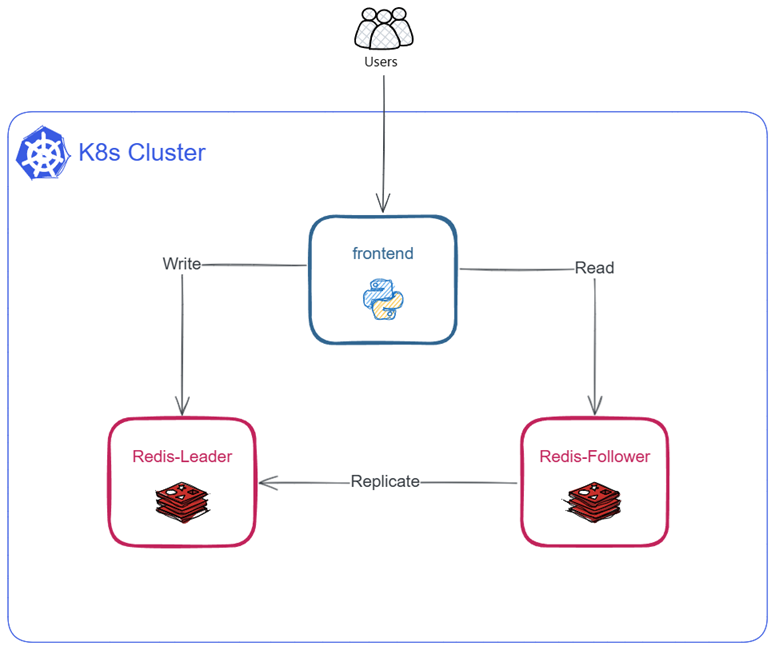
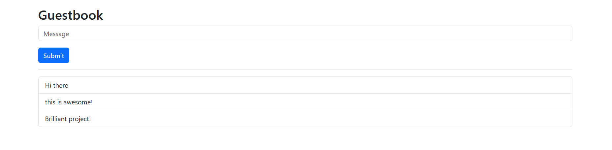

# Guestbook

**A multi-tier web application with Redis and Python (FastAPI) using Kubernetes.**

This a application is based on a [Google](https://docs.cloud.google.com/kubernetes-engine/docs/tutorials/guestbook) and [kubernetes](https://kubernetes.io/docs/tutorials/stateless-application/guestbook/) samples with PHP but overwritten with Python and few minor changes in deployments, services manifests to make it easier working with local Redis and frontend application images.



### creating a cluster

You need to have a Kubernetes cluster, and the kubectl command-line tool must be configured to communicate with your cluster:

```bash
kind create cluster --name guestbook-cluster --config kind-cluster.yaml
kubectl create namespace guestbook
```

Build a docker image for Guestbook frontend application (`guestbook`):

```bash
cd python-redis && docker build --target runtime -t irajjelodari/guestbook:1.0.0 .
```

Load docker images (Redis and gb-frontend) into your cluster nodes:

```bash
kind load docker-image 'redis:8.8.2' --name=guestbook-cluster
kind load docker-image 'irajjelodari/guestbook:1.0.0' --name=guestbook-cluster
```

Apply the manifests:

```bash
kubectl apply -n guestbook -f redis-leader-deployment.yaml
kubectl apply -n guestbook -f redis-leader-service.yaml

kubectl apply -n guestbook -f redis-follower-deployment.yaml
kubectl apply -n guestbook -f redis-follower-service.yaml

kubectl apply -n guestbook -f frontend-deployment.yaml
kubectl apply -n guestbook -f frontend-service.yaml
```

Expose the frontend service using `port-forward` command to access the application on your local machine:
```bash
kubectl port-forward -n guestbook service/frontend 8542:8000
```



### Clean-up

To clean up everything:

```bash
kubectl delete -n guestbook deployment -l app=redis
kubectl delete -n guestbook service -l app=redis
kubectl delete -n guestbook deployment frontend
kubectl delete -n guestbook service frontend

kubectl delete namespace guestbook

kind delete cluster --name guestbook-cluster
```
